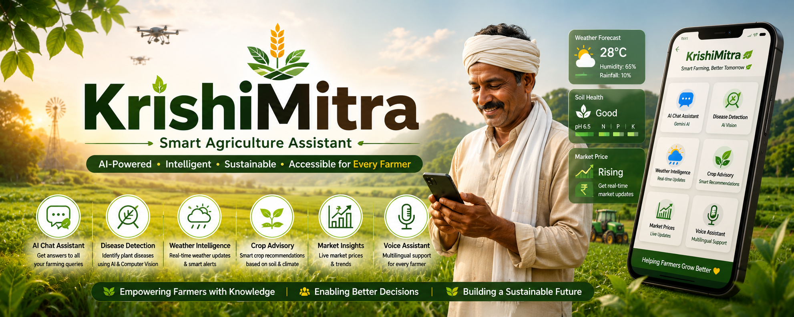
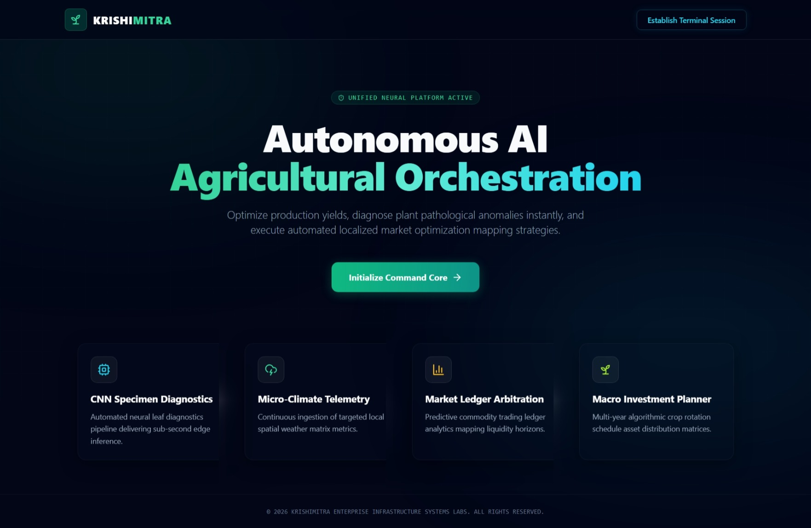
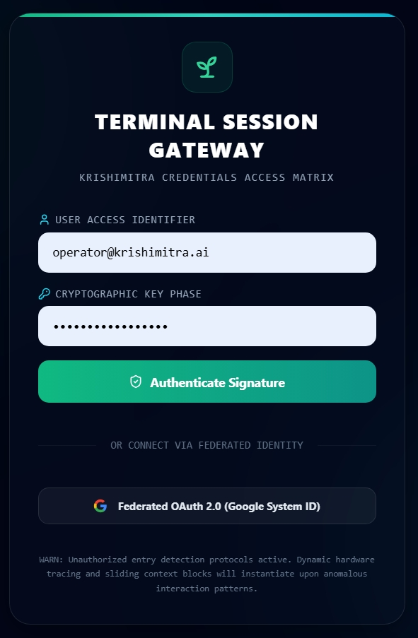
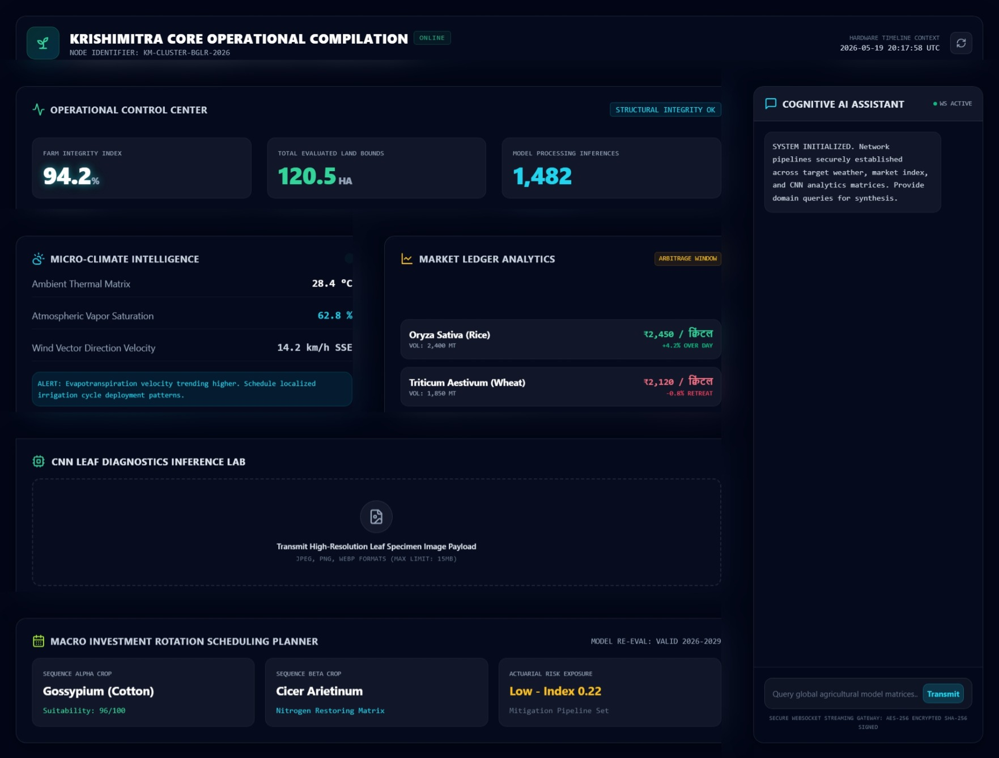
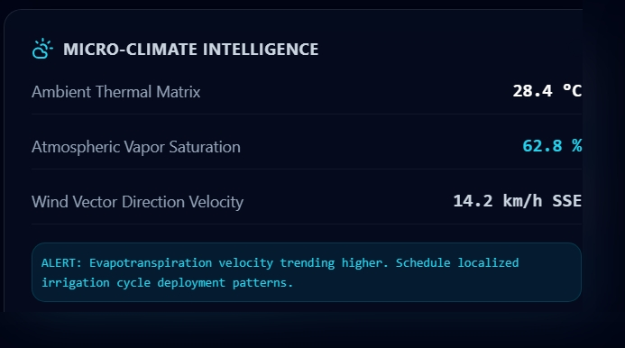
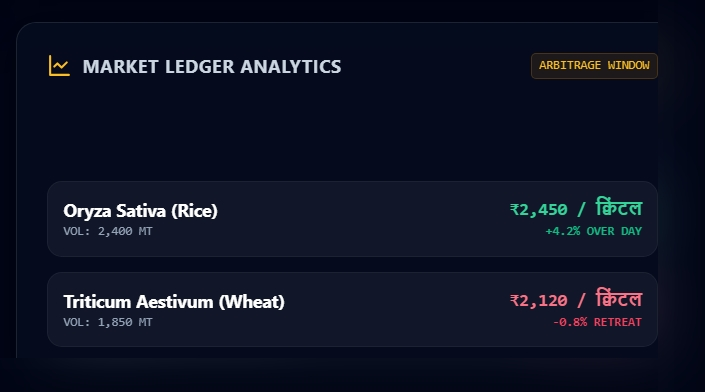
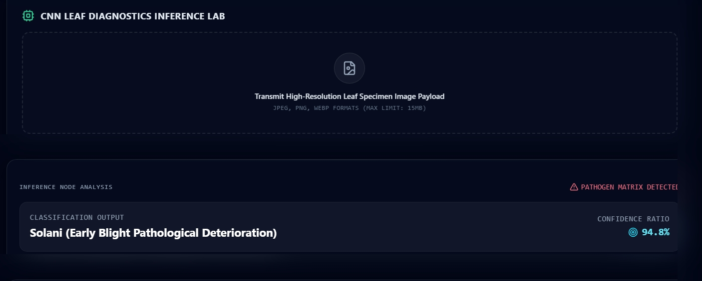
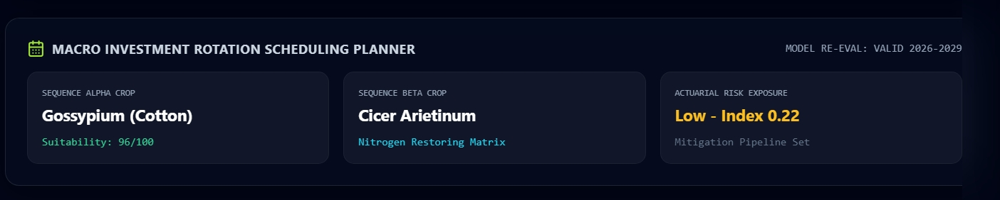
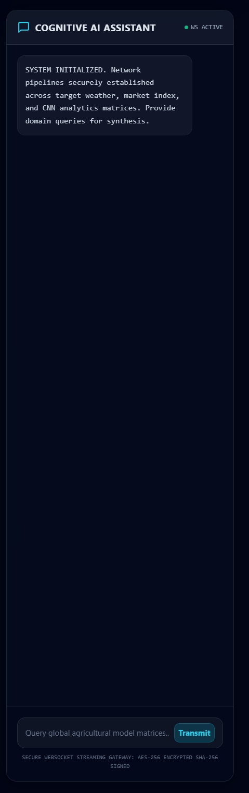
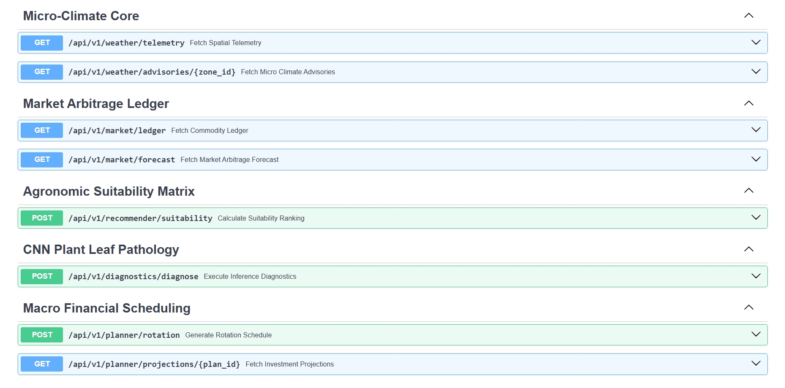

<p align="center">
  
</p>

<br>


# 🌾 KrishiMitra AI

## AI-Powered Multilingual Agriculture Assistant

KrishiMitra AI is an intelligent agriculture platform designed to assist farmers through Artificial Intelligence, Machine Learning, Computer Vision, and Natural Language Processing. The platform provides crop guidance, disease detection, weather intelligence, multilingual support, and AI-powered agricultural assistance to improve productivity and decision-making.

---

## 📖 Project Overview

Agriculture remains one of the most important sectors globally, yet many farmers face challenges in accessing timely information regarding crop health, weather conditions, disease management, and farming best practices.

KrishiMitra AI addresses these challenges by combining AI technologies with a user-friendly interface, enabling farmers to receive personalized agricultural guidance in multiple languages.

---

## 🚀 Key Features

### 🌱 Smart Crop Assistance

* Crop recommendations
* Farming best practices
* Agricultural guidance

### 🔍 Plant Disease Detection

* AI-powered image analysis
* Plant disease identification
* Early warning system

### 🌦️ Weather Intelligence

* Weather insights
* Climate-aware recommendations
* Seasonal farming guidance

### 🤖 AI Chat Assistant

* Gemini AI integration
* Context-aware responses
* Agriculture-focused assistance

### 🗣️ Multilingual Support

* Multiple language interactions
* Voice-enabled communication
* Farmer-friendly experience

### 📊 Smart Agriculture Insights

* Data-driven recommendations
* Productivity optimization
* Decision support system

### 🔐 Secure Platform

* User authentication
* Secure API architecture
* Protected data handling

---

## 🛠️ Technology Stack

### Frontend

* Next.js
* TypeScript
* Tailwind CSS

### Backend

* Python
* FastAPI

### Artificial Intelligence

* Google Gemini AI
* Machine Learning Models
* Natural Language Processing
* Computer Vision

### Infrastructure

* Docker
* Nginx
* Redis

### DevOps

* GitHub Actions
* CI/CD Pipelines

### Database

* PostgreSQL

---

## 🏗️ System Architecture

```text
┌──────────────────────────────────────────────────────────────┐
│                        END USERS                             │
│ Farmers | Agriculture Experts | Researchers | Admins         │
└───────────────────────┬──────────────────────────────────────┘
                        │
                        ▼
┌──────────────────────────────────────────────────────────────┐
│                  FRONTEND LAYER (Next.js)                    │
│                                                              │
│  • Landing Page                                              │
│  • Authentication Gateway                                    │
│  • Dashboard                                                 │
│  • Disease Detection Interface                               │
│  • Weather Intelligence Dashboard                            │
│  • Market Analytics Dashboard                                │
│  • Crop Planning Module                                      │
│  • AI Assistant Chat Interface                               │
└───────────────────────┬──────────────────────────────────────┘
                        │ REST API / WebSocket
                        ▼
┌──────────────────────────────────────────────────────────────┐
│                  API GATEWAY (FastAPI)                       │
│                                                              │
│  Authentication Service                                      │
│  Health Monitoring Service                                   │
│  Dashboard Service                                           │
│  WebSocket Communication Service                             │
└───────────────────────┬──────────────────────────────────────┘
                        │
        ┌───────────────┼────────────────┬────────────────┐
        ▼               ▼                ▼                ▼

┌────────────────┐ ┌────────────────┐ ┌────────────────┐ ┌────────────────┐
│ Weather Engine │ │ Market Engine  │ │ Planning Engine│ │ AI Chat Engine │
└───────┬────────┘ └───────┬────────┘ └───────┬────────┘ └───────┬────────┘
        │                  │                  │                  │
        ▼                  ▼                  ▼                  ▼

┌──────────────────────────────────────────────────────────────┐
│             COMPUTER VISION & AI LAYER                       │
│                                                              │
│  • Crop Disease Detection                                    │
│  • Leaf Image Classification                                 │
│  • CNN / TensorFlow Models                                   │
│  • Feature Extraction                                        │
│  • Disease Prediction Engine                                 │
└───────────────────────┬──────────────────────────────────────┘
                        │
                        ▼
┌──────────────────────────────────────────────────────────────┐
│               GENERATIVE AI INTELLIGENCE                     │
│                                                              │
│  Google Gemini AI                                            │
│  • Agricultural Question Answering                           │
│  • Crop Advisory                                              │
│  • Disease Explanation                                        │
│  • Treatment Recommendations                                  │
│  • Multilingual Support                                       │
└───────────────────────┬──────────────────────────────────────┘
                        │
                        ▼
┌──────────────────────────────────────────────────────────────┐
│                    DATA MANAGEMENT LAYER                     │
│                                                              │
│  SQL Database                                                │
│  • User Data                                                 │
│  • Crop Data                                                 │
│  • Disease Records                                           │
│  • Planning Records                                          │
│                                                              │
│  Redis Cache                                                 │
│  • Session Storage                                           │
│  • API Response Cache                                        │
│  • Real-Time Data Cache                                      │
└───────────────────────┬──────────────────────────────────────┘
                        │
                        ▼
┌──────────────────────────────────────────────────────────────┐
│                  EXTERNAL SERVICES                           │
│                                                              │
│  • Google Gemini API                                         │
│  • Weather Data APIs                                         │
│  • Market Price APIs                                         │
│  • Image Processing Models                                   │
└──────────────────────────────────────────────────────────────┘
```

## 🔄 Data Flow Architecture

```text
Farmer Uploads Leaf Image
            │
            ▼
Frontend (Next.js)
            │
            ▼
FastAPI Backend
            │
            ▼
Disease Detection Module
            │
            ▼
TensorFlow CNN Model
            │
            ▼
Disease Prediction
            │
            ▼
Gemini AI Recommendation Engine
            │
            ▼
Organic Solutions
Chemical Solutions
Prevention Methods
Crop Advisory
            │
            ▼
Results Displayed on Dashboard
```


---

## 📂 Project Structure

```text
KRISHIMITRA-MONOREPO
│
├── .github
│   └── workflows
│
├── backend
│   ├── app
│   ├── core
│   ├── ml
│   ├── models
│   ├── schemas
│   ├── services
│   ├── storage
│   └── tests
│
├── frontend
│   ├── public
│   ├── src
│   └── configuration files
│
├── devops
│   ├── nginx
│   ├── redis
│   └── scripts
│
├── docker-compose.prod.yml
└── README.md
```

---

## ⚙️ Installation

### Clone Repository

```bash
git clone https://github.com/Sagar-bv/KrishiMitra-AI.git
cd KrishiMitra-AI
```

### Backend Setup

```bash
cd backend
pip install -r requirements.txt
```

### Frontend Setup

```bash
cd frontend
npm install
npm run dev
```

### Run Application

```bash
docker-compose up
```

---

## 📸 Application Screenshots

### 🏠 Landing Page


### 🔐 Authentication Gateway


### 📊 Dashboard Overview


### 🌦️ Weather Intelligence


### 📈 Market Analytics


### 🌱 Disease Detection


### 🌾 Crop Planning


### 🤖 AI Assistant


### 📚 API Documentation

## 🎯 Future Enhancements

* IoT Sensor Integration
* Advanced Disease Prediction
* Crop Yield Forecasting
* Farmer Marketplace
* Mobile Application
* Satellite Data Analytics
* Smart Irrigation Recommendations
* Agricultural Financial Planning

---

## 👨‍💻 Author

### Sagar B V

MCA Student | AI & Machine Learning Enthusiast

* GitHub: https://github.com/Sagar-bv
* LinkedIn: https://www.linkedin.com/in/sagar-bv/

---

## ⭐ Support

If you found this project useful, consider giving it a star on GitHub.

⭐ Star this repository to support future development.
